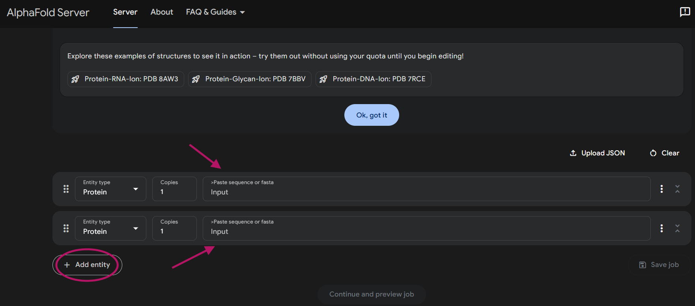
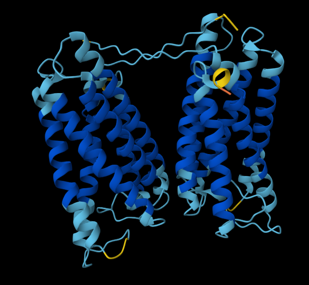

# 🧬 Welcome to the AlphaFold Workshop: 
# Protein-Protein Interaction Predictions

Hello and welcome! 👋  

This repository is part of a hands-on workshop on using `AlphaFold` to predict **protein-protein interactions**. In this guide, you'll learn how to:

- Collect protein sequences
- Prepare them for multimer predictions
- Run AlphaFold on the server and on the HPC
- Analyze the results and structure quality

Whether you're a beginner in structural biology or just trying to automate your protein interaction screening, this walkthrough is for you!

---

# 🧪 What We'll Do in This Workshop

In this workshop, we will focus on predicting interactions between a protein of interest and a list of candidate partners using structure-based modeling.

The goal is to predict how each candidate might interact directly with the protein of interest. To do this, we’ll combine their sequences into pairs, generate 3D models and assess whether a meaningful interaction is likely.

**By the end of the session, you'll understand how to:**

- Go from UniProt IDs to structural models 

- Prepare sequence pairs for interaction prediction

- Evaluate the predicted structures to identify high-confidence interactions

This approach is useful for generating testable hypotheses about protein binding, interaction networks, and functional partnerships.


## 🚀 Step 1: Get Your Protein Sequences

To predict protein-protein interactions using AlphaFold, we need to provide both protein sequences. Each protein is represented by its amino acid sequence (in FASTA format). Below you can find the UniProt IDs for the Target protein and the partner proteins we are going to test. Feel free to choose one (or more) partner protein.

You can get protein sequences from [UniProt](https://www.uniprot.org/)


- **Target protein:**

	- Dram2_mouse (Q9CR48) 


- **Partner proteins:**

	* Q9DC58
	* O70404	     
	* Q9CZX7
	* Q6GSS7
	* P61161	   
	* C0HKE1 
	* P31996    
	* P17047
	* Q99KI0
	* Q9QY73
	* Q8R143
	* Q922T2
	* Q5SRX1
	* Q91YT8
	* Q91VK4
	* O88384   


## :facepunch: Step 2: Running a protein-protein prediction on AlphaFoldServer


You need to Login to the [AlphaFoldServer](https://alphafoldserver.com/) page online. If you do not have an account, you can quickly create one. :bowtie:


## The input page on AlphaFoldServer should look like that:




### To do:

1. Copy the target protein **Fasta** and paste it in the **input box**

2. Select **'Add entity'** to add another input box

3. Copy and paste the partner protein **Fasta** in the other **input box**

4. Select **'Continue and preview this job'**

5. Give a **name** to your job (recommended: Protein IDs)

6. Select **'Confirm and submit this job'**


**Notes:**

* It takes 2-3 min to run a protein-protein prediction, depending on the size of the proteins, so take a sip of coffee!

* You probably have a lot of questions about your model (at least I did the first time). 

* Let's try to assess the output together. What do you think about your model?

 


## :wrench: Step 3: Installing some tools

Before we proceed with folding proteins on the Cluster, we have some tools to install. I hope this will not take long!


### Tool 1: MobaXterm

MobaXterm is a powerful SSH client and terminal with X11 server support. Here's how to get it:

**Steps:**

1. Go to the official website: [MobaXterm](200~https://mobaxterm.mobatek.net/download.html)

2. Choose the version:

	- Download the Home Edition.

	- Choose the Installer edition (so it installs like a normal program) or Portable edition (just unzip and run).

3. Install (if you chose Installer edition):

	- Run the .exe file.

	- Follow the installation steps.


### Tool 2: Pymol

PyMOL is a molecular visualization system. You can install the open-source version or the commercial one.


#### - Option A: Install Open-Source PyMOL (via Conda)

**Requirements:**

	Install Anaconda or Miniconda


**Steps (in Anaconda Prompt):**

```
conda create -n pymol-env -c schrodinger pymol
conda activate pymol-env
pymol
```

This creates a new environment and installs PyMOL from the Schrödinger channel.


#### - Option B: Commercial Pymol

1. Follow the link: [Pymol](https://www.pymol.org/)

2. Sign up or purchase a license. 

	You can also use my licence: :speak_no_evil:

	Download the [license](assets/pymol-edu-license.lic)

3. Download the installer for your OS and follow the instructions.


## :bomb: Step 4: Creating the input for running AlphaFold on the HPC 

You are now at the step of preparing input files to run interaction modeling on an HPC cluster using AlphaFold3.

To run interaction modeling on the cluster, we need to prepare inputs that define which two proteins should be modeled together as a complex. The input should be Json files. This format makes it easy to automate many pairwise runs between a protein of interest and multiple partners.

**To Do:**

1. Upload the `FASTA` sequences on the cluster or Copy them in a text file (You need the **target** protein and the **partner** protein)

2. Clean the headers (if necessary)

3. Split the sequences (in case you have them in the same file)

4. Convert to `.json` 

	Convert your `Fasta` to `json` by running the [script](scripts/fasta_to_json.py)

5. Create a directory (naming example: A1L0T0_with_Q8N682) and move you `json` file in it.


---

## 🙌 Thanks for Participating!

We hope this workshop gives you the confidence to explore and predict protein interactions.

## Happy folding! 🧬
